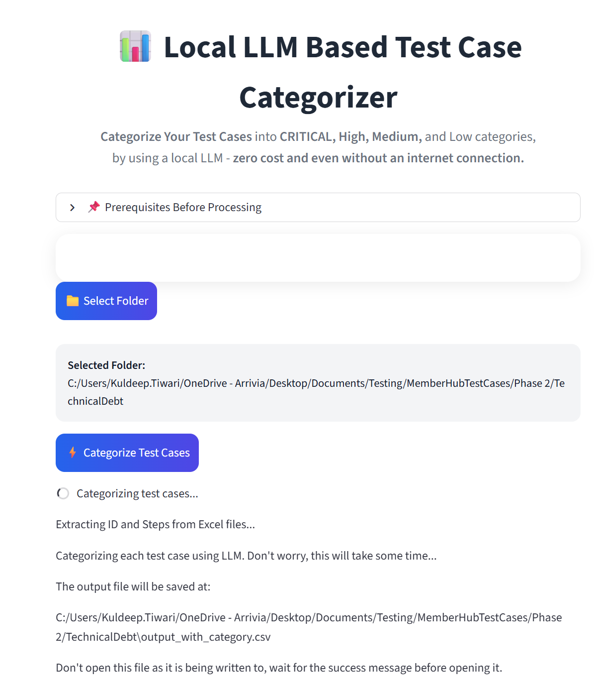

# categorize-test-cases
This application categorizes the test cases (exported from Azure DevOps portal) into categories CRITICAL, High, Medium and Low.

# WHY local LLM
 ### There are 100s and sometimes thousands of test cases (MemberHub application has 850+ test cases) for single application,
 ### The criteria to categorize test cases may keep evolving and hence might need finetuning - which means we might need to run the LLM on this big number of test cases multiple times - just for a single application.
 ### This activity does not need any context other then the categorization criteria (i.e. prompt) and the test cases, and hence shoud be doable even without having an  internet connection.


# Prerequisites
 ### Install Ollama on your local - https://ollama.com/download
 ### Download the default model 'qwen2.5:7b' using Ollama command 
 ```bash
 - ollama pull qwen2.5:7b
```
### Check if the criteria to categorise the test cases is different from the default value present in the file src/categorization-criteria-prompt.txt - if yes, modify this file's logic (but not the structure)


# Steps
 ## 1. Export your test cases from Azure DevOps portal to your local folder. For example, memberhub test cases are at - https://dev.azure.com/arrivia/SoftEng/_testPlans/execute?planId=108074&suiteId=108075
 ## 2. Python way to start the application
  ### Python based steps 
   #### a. Build the application
    ```bash
 pip install -r requirements.txt
    ```
#### b. Start the application
```bash
 dev-tools\categorize-test-cases> streamlit run .\src\app.py --server.address="0.0.0.0"
```
     
#### b. You should the below UI launched, where you can select the folder name where you had exported excel sheet (not the root folder, but exact sub-folder having excel sheets) - 

<div align="center">
  
</div>

## 3. Docker way (Far simpler)
 ### Have Docker installed
 ### Run the command from inside the directory 'categorize-test-cases'
 ```bash
 docker build -t categorize-test-cases .
```
### start the docker application
 ```bash
 docker run -p 8501:8501 categorize-test-cases 
```

### Now open the bowser - 
```bash
 http://localhost:8501/ 
```
